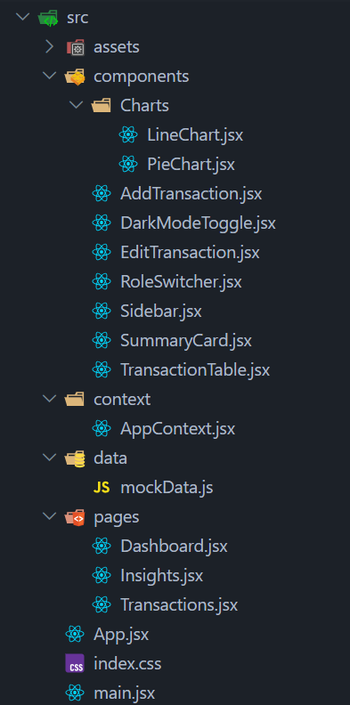

# Finance Dashboard UI

A clean and interactive finance dashboard built to track and understand financial activity.  
This project demonstrates frontend design, component structure, state management, and user experience.

---

## Overview

This dashboard allows users to:

- View overall financial summary
- Analyze spending patterns
- Manage transactions
- Switch roles (Viewer/Admin)
- Experience a responsive and modern UI with dark mode support

---

## Features Implemented

### Dashboard Overview
- Summary cards for:
  - Total Balance
  - Income
  - Expenses
- Clean and intuitive layout

### Data Visualizations
- **Line Chart** for balance trend over time
- **Pie Chart** for spending breakdown by category

### Transactions Management
- View transactions with:
  - Date
  - Amount
  - Category
  - Type (Income/Expense)
- Add new transactions (Admin only)
- Edit existing transactions (Admin only)
- Delete transactions (Admin only)

### Filtering, Search, and Sorting
- Search transactions by category
- Filter by type (Income / Expense)
- Sort by:
  - Date
  - Amount
  - Ascending / Descending order

### Role-Based UI
- **Viewer**
  - Read-only access
- **Admin**
  - Full CRUD access (Add, Edit, Delete)
- Role switching handled on frontend for demonstration

### Insights Section
- Displays highest spending category
- Provides basic financial observations

### State Management
- Implemented using **React Context API**
- Handles:
  - Transactions
  - Filters
  - Role
  - UI state (dark mode)

### Data Persistence
- Transactions stored in **LocalStorage**
- Theme preference persisted across reloads

### Dark Mode
- Fully supported dark/light theme
- Professional toggle switch UI
- Consistent styling across all components

### Responsive Design
- Works across:
  - Mobile
  - Tablet
  - Desktop
- Built using Tailwind CSS responsive utilities

---

## Tech Stack

- **React (Vite)**
- **Tailwind CSS**
- **Recharts**
- **Context API**
- **LocalStorage**

---

## Project Structure

---

## Getting Started

### 1. Clone the repository

https://github.com/Divyanshii-Rajput/FinanceDashboard.git

### 2. Navigate to project folder

cd finance-dashboard

### 3. Install dependencies

npm install

### 4. Run the project

npm run dev

---

## Key Highlights

- Clean and modular component structure
- Thoughtful UI/UX design
- Real-world features like role-based UI and data persistence
- Strong focus on usability and responsiveness

---

## Future Improvements (Optional)

- Export transactions (CSV/JSON)
- Advanced analytics & charts
- Backend integration (API)
- Authentication system
- Custom dropdown components (for full styling control)

---

## Author

Built as part of a frontend assignment to demonstrate practical UI development skills.
